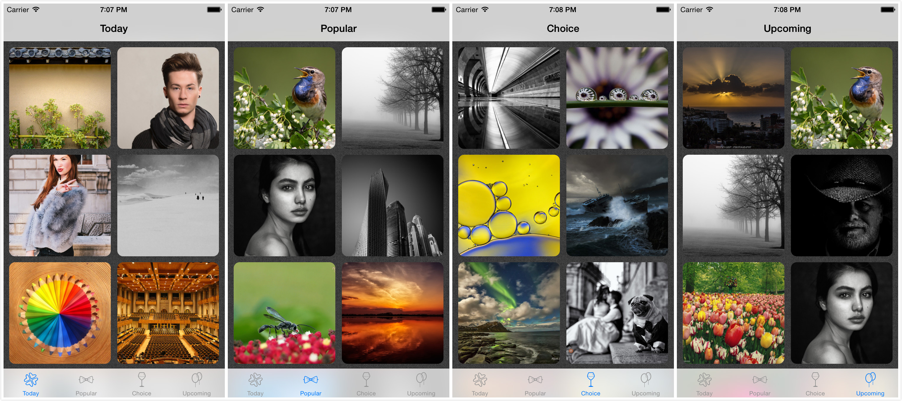
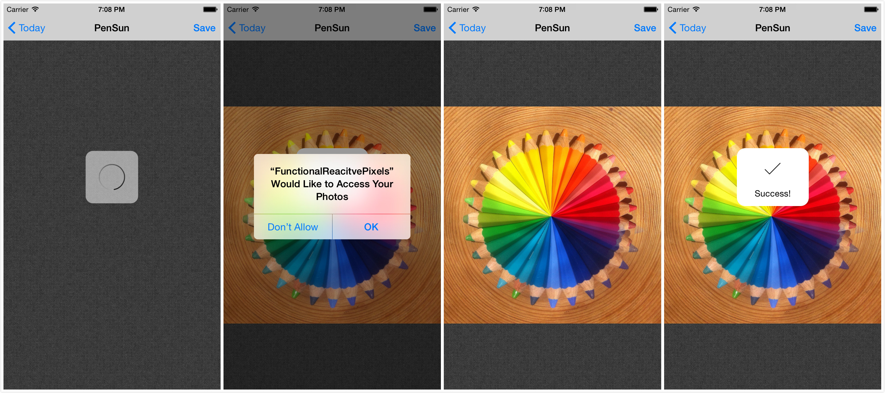

# Functional Reactive Pixels

An app that can browse and download pictures from  the website `500px`.

## Features
+ Four different channels:
	+ Today
	+ Popular
	+ Choice
	+ Upcoming
	
</center></center>

+ High-quality picture download:

</center></center>

## Build & Run
1. Install & Setup Cocoapods

	``` bash
	gem install cocoapods
	pod setup
	```
	
2. Install Dependencies

	``` bash
	pod install
	pod update
	```

3. Open `FunctionalReactivePixels.xcworkspace`
4. Run

## Dependencies
+ Cocoapods
+ ReactiveCocoa
+ Libextobjc
+ 500px-iOS-api
+ SVProgressHUD


